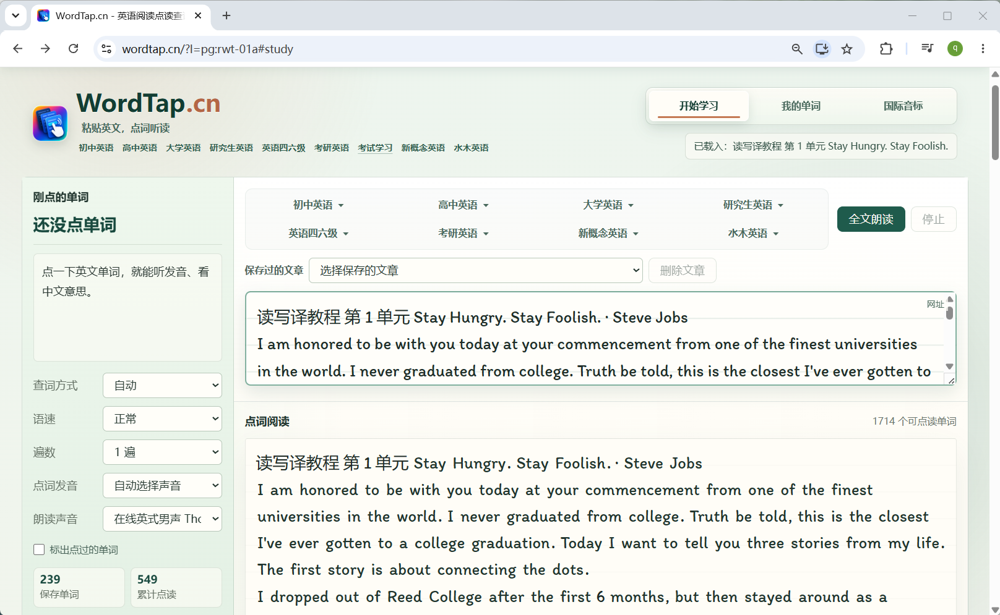

# WordTap — 英语阅读、点读查词与文章跟打

**English reading, vocabulary learning & typing practice.**

[](https://wordtap.cn/)
[](LICENSE)

粘贴一篇英文，把阅读、查词、听读和跟打放在一起。**WordTap 是面向中文学习者的开源英语阅读工具**：点击生词查看中文释义、听发音，在原文里理解单词，再逐句跟打练习；学习记录保存在当前浏览器中。

WordTap is an open-source English learning web app for Chinese-speaking learners. Read your own text, tap words for Chinese definitions and pronunciation, listen to sentences, and practice typing the same article. Study records are stored in your browser.

**[立即使用 WordTap](https://wordtap.cn/)** · [快速上手](#快速上手) · [本地运行](#开发命令) · [English overview](#english-overview) · [反馈问题](https://github.com/hawkhai/wordtap.cn/issues)

[](https://wordtap.cn/)

## 快速上手

1. 打开 **[wordtap.cn](https://wordtap.cn/)**，无需注册。
2. 粘贴自己的英文文章，或从课程菜单选择一篇材料。
3. 点击不认识的单词，查看释义、听发音；也可以打开音标显示、使用句末朗读按钮。
4. 开启文章跟打，逐句练习；之后在“我的单词”查看查过的词，继续阅读或练习。

基础阅读、ECDICT 查词和文章跟打无需安装 Gateway。单词发音优先使用浏览器语音；可选的 Windows Gateway 提供更高质量的全文朗读及部分在线查词能力，见[安装说明](https://wordtap.cn/install/gateway/)。

## 用同一篇文章练阅读、听读和输入

| 想做什么 | WordTap 能帮你做什么 |
| --- | --- |
| 精读英文，少切换查词窗口 | 在原句中点词查中文释义，听单词发音，按需显示音标 |
| 听懂句子，再练跟读 | 单词、逐句与全文朗读，支持语速、遍数及全文暂停／继续 |
| 练习英文输入和拼写 | 全文或选区跟打、输入错误提示、自动读句／读词、草稿与进度恢复 |
| 留下自己的学习记录 | 自动记录查词次数与时间，保存文章；考试页记录进度、生词上下文与掌握状态 |
| 学习教材、词库和考试阅读 | 从课程或词库进入阅读与练习，菜单记住分组、最近课文和滚动位置 |
| 在自己的设备上管理数据 | 浏览器本地保存，支持导出完整学习备份并在另一设备手动导入 |

适合英语自学者、四六级／考研备考者、准备阅读材料的老师，也适合每天阅读英文技术文档、论文摘要或邮件的人。可以直接粘贴自己的材料，从眼前这一段英文开始。

## 课程与词库

| 学习材料 | 当前收录 | 入口 |
| --- | --- | --- |
| 新概念英语 | 276 篇 | [新概念英语点读](https://wordtap.cn/nce/) |
| 水木英语 | 192 篇 | [水木英语阅读](https://wordtap.cn/shuimu/) |
| 研究生英语 | 40 篇 | [研究生英语阅读](https://wordtap.cn/postgraduate/) |
| 大学英语 | 72 篇 | [大学英语阅读](https://wordtap.cn/college-english/) |
| 人教版英语 | 12/17 册、313 篇 | [人教版英语点读](https://wordtap.cn/pep-english/) |
| 英语四六级真题 | 97 套 | [CET-4 / CET-6 阅读](https://wordtap.cn/cet/) |
| 考研英语真题 | 64 套 | [考研英语阅读](https://wordtap.cn/kaoyan-english/) |
| 英语词汇 | 23 套词库、5,860 个学习单元 | [仓库内词库与例句数据](public/english-vocabulary/) |

词库覆盖 CET-4、CET-6、考研、IELTS、TOEFL、GRE、GMAT、SAT、专四、专八及中小学英语等，共 116,953 条源记录；该数字不是去重后的单词数。词汇单元支持搜索、阅读、例句跟打与分享。

课程与词典数据保留各自的来源和权利条件。人教版缺失的 5 册未用占位内容补齐；120 篇文章仍待来源确认，16 处词汇源数据问题原样保留。具体状态见[发布说明](content/release/README.md)和[第三方声明](THIRD_PARTY_NOTICES.md)。

## 数据、离线与朗读

**学习数据在哪里？** 单词、保存的文章、考试记录和跟打进度保存在当前浏览器的 IndexedDB。更换设备或清理浏览器数据前，请在考试学习页使用“导出学习数据”；“我的单词”中的单词导出不等于完整备份。完整备份可手动导入并与本机记录合并，翻译和音频缓存不包含在备份中。

**能离线使用吗？** 支持轻量离线使用：已经缓存的应用页面、同源资源、词典分片和朗读音频可能继续可用。首次加载、未缓存的词典分片、新的在线翻译和 Gateway 语音生成仍需要网络。不会预先下载全部词典，也不保证完整离线使用。

**朗读需要安装什么？** 浏览器语音可用于单词和全文朗读，可用声音取决于设备与浏览器；单词发音失败时会尝试 Youdao 音频。可选 Windows Gateway 提供 Edge TTS 全文朗读和 Baidu Sug 查词，服务端源码及安装器构建链不在本仓库中。遇到问题可打开应用中的诊断视图检查。

**本地保存是否意味着所有处理都在本机？** 本地保存指学习记录的存储位置。启用在线查词、备用发音或 Gateway 在线朗读时，相应单词或文本会发送给对应服务。

## English overview

WordTap brings **English reading, dictionary lookup, text-to-speech (TTS), vocabulary learning, and article typing practice** into one browser workspace. The interface and dictionary definitions are primarily in Chinese.

- Paste your own English text or choose a published lesson or vocabulary unit.
- Tap a word for its Chinese definition and pronunciation; display IPA phonetics while reading.
- Listen to sentences and practice typing an article or a selected passage, with saved drafts and progress.
- Keep study records in browser storage and transfer them manually with a learning-data backup.
- Run the Vue 3 + TypeScript + Vite web client locally. The optional Windows Gateway is distributed separately.

**[Try WordTap online](https://wordtap.cn/)** — no account required. Offline use is limited to cached resources; online translation and speech services may receive the words or text you ask them to process. Original code and documentation use Apache-2.0; third-party materials retain their own terms.

## 开发命令

Web 开发、构建与统一验证只需要 Node.js 20.19+ 和仓库内的发布数据，不需要 Python、Rust、原始教材、词汇 JSONL 或审核日志。

```bash
git clone https://github.com/hawkhai/wordtap.cn.git
cd wordtap.cn
npm ci
npm run dev
```

打开终端显示的本地地址。构建与验证在项目目录中运行：

```bash
npm run build
npm test
npm run verify
```

`build` 校验发布数据和类型，打包应用并生成课程、词库、考试与安装说明静态页面，检查短链接、资源和主题；`test` 运行业务回归；`verify` 构建一次，再运行业务、响应式和开源检查。

定向命令：`npm run typecheck`、`npm run verify:published`、`npm run verify:responsive`、`npm run verify:open-source`。

独立浏览器验收：`npm run verify:browser`。需另行提供 Playwright 与 Chromium；使用 `WORDTAP_PLAYWRIGHT_MODULE`、`WORDTAP_CHROMIUM_EXECUTABLE`、`WORDTAP_TEST_URL` 和 `WORDTAP_TEST_OUTPUT` 配置，产物默认放入忽略的 `tmp/web-sync/`。普通构建及 CI 不下载浏览器。

安装器不在本仓库内，所有下载入口使用官方 HTTPS 地址；安装说明保留在当前站点。跨域下载或缺少可选发布元数据时，诊断会说明无法确认，不将其判定为 Web 应用失败。

## 技术与维护参考

<details>
<summary>展开：代码结构、本地数据、查词与朗读流程、Gateway 接口及维护约定</summary>

## 代码结构

```text
src/
  App.vue                         # 选择桌面壳或移动壳
  main.ts                         # 挂载 Vue，加载全局样式，注册 Service Worker
  style.css                       # 共享基础样式和组件样式
  desktop/
    components/DesktopShell.vue   # 桌面端布局和导航
    styles/desktop.css            # 桌面端响应式规则
  mobile/
    components/MobileShell.vue    # 移动端布局、长按复习操作
    styles/mobile.css             # 移动端响应式规则
  shared/
    composables/useWordTap.ts     # 学习、查词、朗读、缓存、诊断主逻辑
    stores/historyStore.ts        # IndexedDB 持久化
    utils/                        # 词典、Gateway、朗读、资源地址等工具
public/
  dict/                           # ECDICT 静态词典 manifest 和分片
  fonts/                          # 阅读与音标字体及许可证
  */lessons/                      # 随站点发布的课程数据
  sw.js                           # 轻量运行时缓存 Service Worker
content/release/                  # 当前发布哈希、来源版本及已知问题
tools/                            # 页面生成、发布检查与业务测试
```

课程原始文件、OCR 工作目录、安装包和构建产物不会提交到仓库；可复现的站点数据位于 `public/`。

## 本地数据

WordTap 使用 IndexedDB 数据库 `wordtap-study-history`，当前版本为 6。

主要存储：

- `words`：学习过的单词、次数、时间和释义。
- `texts`：保存的阅读文本。
- `translation_cache`：翻译缓存。
- `audio_cache`：Gateway 生成的全文朗读音频。
- `audio_cache_meta`：音频缓存元数据。
- `exam_progress`、`exam_word_encounters`：考试进度与考试生词。
- `article_typing_progress`：文章跟打草稿、选区及完成进度。

考试学习页的“导出学习数据”会备份单词、保存的文章、考试进度、考试生词和跟打进度；导入时会与本机记录合并。翻译和音频缓存可重新生成，不包含在备份中。

限制规则：

- 阅读文本最多保留 100 条。
- 单条文本最多 120,000 个字符。
- 翻译缓存最多 5,000 条。
- 音频缓存同时按数量和大小清理，并带有引擎版本校验。

启动时，应用会优先恢复最近保存的阅读文本。如果没有保存内容，默认示例文本只会在首次使用的前几次启动中显示，之后编辑区会保持为空。

## 查词流程

英文单词识别规则：

```text
[A-Za-z]+(?:['-][A-Za-z]+)?
```

每次查词都会先检查内存缓存和 IndexedDB 翻译缓存，再访问具体来源。

翻译模式：

- `auto`：本地 ECDICT 分片 -> Gateway Baidu Sug -> 内置兜底词典。
- `ecdict`：本地 ECDICT 分片 -> 内置兜底词典。
- `baidu_sug`：Gateway Baidu Sug -> 本地 ECDICT 分片 -> 内置兜底词典。

查询时会尝试原词、小写形式和简化形式。用户点击单词后，学习次数会立即记录；释义查询成功后，再回写到学习记录。

## 朗读流程

全文朗读：

- Gateway 可用时，优先调用 `/v1/recipes/speech` 生成 MP3 音频。
- 前端会按句子和段落切分文本，单个片段限制为 1,000 字节。
- 会预取前几个片段并顺序播放。
- 已缓存的 Gateway 音频可以在 Gateway 未运行时播放。
- Gateway 不可用时，会尝试浏览器全文朗读。

单词朗读：

- 优先使用浏览器 `speechSynthesis` 和用户选择的英语声音。
- 浏览器播放失败或超时后，回退到 Youdao `dictvoice` 音频。

## 本地词典

静态词典位于 `public/dict`，由 ECDICT 转换生成。

当前 manifest 数据：

- 版本：`ecdict-static-shards-v1`
- 词条数：765,023
- 分片数：10,129
- 目标分片大小：100,000 字节
- manifest 中最大分片：`ple`，99,941 字节，837 条
- 生成时间：`2026-06-14T18:37:09.373611+00:00`

Service Worker 不会预缓存全部词典分片。只有已经请求过的分片，才可能在后续离线时从缓存读取。

## WordTap Gateway

Gateway 是可选的本地 Rust 服务，默认地址：

```text
http://127.0.0.1:18765
```

主要接口：

- `GET /v1/status`
- `GET /v1/capabilities`
- `POST /v1/recipes/speech`
- `POST /v1/recipes/baidu-sug`
- `POST /v1/http/exchange`
- `POST /v1/ws/exchange`
- `POST /v1/ws/sessions`
- `POST /v1/lifecycle/shutdown`

安全模型：

- 状态接口可以公开读取。
- WordTap 可信域名和本地开发域名可以使用配方接口。
- 公开网页不能使用通用本地工具交换接口。
- 关闭服务接口只允许安装器携带本地 token 调用。

## 界面风格与后续迭代

本项目沿用 cf-design / Arco Design 的阅读优先风格，技能来源、设计变量、响应式宽度和交互约定见 [STYLE_GUIDE.md](STYLE_GUIDE.md)，同步说明见 [CF_DESIGN_NOTES.md](CF_DESIGN_NOTES.md)。Vue 和静态生成网页共享主题变量；功能迭代应同时检查这两条渲染路径。`npm run build` 检查全部生成页面的风格；`npm test` 包含主题回归测试。

## 开源版与完整版

开源版保留全部已发布 Web 学习功能；Gateway 与安装器独立交付，原始内容重建和历史审核由完整版负责。功能对照与验收见 [开源版对齐记录](OPEN_SOURCE_ALIGNMENT.md)。

原七套课程共 1,054 份，另有 5,860 个词汇单元。120 篇文章仍待来源确认，16 处词汇源数据问题原样保留；当前发布检查不代表历史审核完成。对应标识、来源与哈希见 [发布说明](content/release/README.md)。

修改课程直接更新发布 JSON、manifest 和索引，按 [课程接入协议](COURSE_INTEGRATION_PROTOCOL.md) 检查和更新发布哈希，无需搭建审核系统。

完整学习备份使用 schemaVersion 4，兼容旧单词数组及版本 2/3 对象，包含单词、文章、考试进度、考试生词和跟打进度，缓存不进入备份。数据库版本 6 采用增量升级；回退前端也必须兼容版本 6，不能降级或清库。

</details>

## 参与项目

如果 WordTap 帮你读懂了一篇英文，欢迎给[项目点一个 Star](https://github.com/hawkhai/wordtap.cn)，方便以后找到它，也让作者知道这项工作对你有帮助。

欢迎通过 [Issues](https://github.com/hawkhai/wordtap.cn/issues) 提交复现步骤、查词问题、课程勘误或使用建议；也欢迎改进文档、浏览器兼容性和阅读／跟打体验。应用内还提供资料提交邮件说明与微信功能建议入口。

提交 Issue 或 Pull Request 前请阅读 [贡献指南](CONTRIBUTING.md)。安全漏洞请按 [SECURITY.md](SECURITY.md) 私下报告。

## 致谢

- [ECDICT](https://github.com/skywind3000/ECDICT)：英汉词典数据，转换为按需加载的静态分片。
- [english-vocabulary](https://github.com/KyleBing/english-vocabulary)：英语词库及例句数据。
- 其他内容与字体来源见 [THIRD_PARTY_NOTICES.md](THIRD_PARTY_NOTICES.md)。

## 第三方内容

词典、字体、课程数据和发音音频不随本项目原创代码改用 Apache-2.0。它们继续适用各自的上游许可证或权利条件，详见 [`THIRD_PARTY_NOTICES.md`](THIRD_PARTY_NOTICES.md)。

## 许可证与派生项目署名

本项目原创代码和文档采用 [Apache License 2.0](LICENSE) 发布。分发 fork 或其他派生版本时：

1. 按照 Apache-2.0 保留 `LICENSE`、`NOTICE` 以及适用的第三方声明。
2. 在派生项目 README 的显著位置明确注明原项目地址和项目网站。可以直接使用下面这段文字：

> 本项目基于 [WordTap](https://github.com/hawkhai/wordtap.cn) 开发；原项目网站：[https://wordtap.cn/](https://wordtap.cn/)。

`NOTICE` 的署名保留义务来自 Apache-2.0 第 4(d) 节；README 中的写法是本项目的派生项目署名规范，不修改 Apache-2.0 正文。完整署名信息见 [`NOTICE`](NOTICE)。
