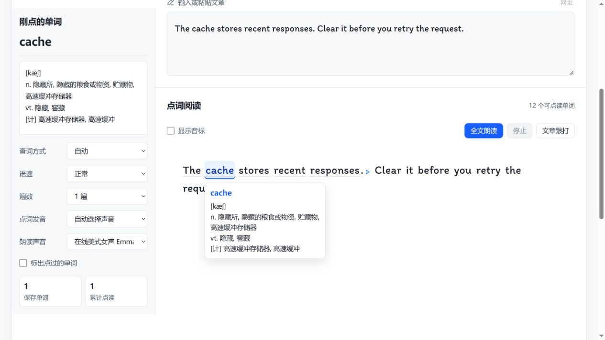
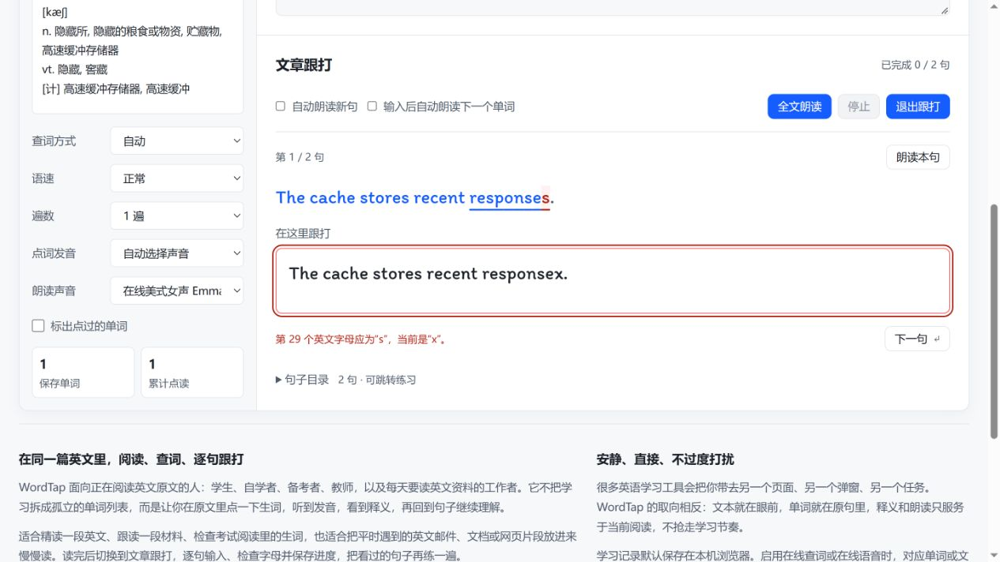
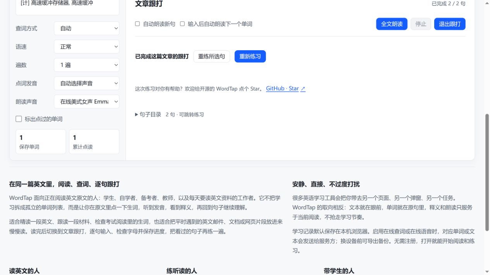

# 用 WordTap 读英文技术文档：点词查释义，再逐句跟打

读 README、API 说明或英文报错时，有时卡住你的只是几个单词。WordTap 可以把一小段英文放在同一个阅读界面里：先点词查看中文释义，再回到原句理解，最后逐句输入练习。

这篇教程用两句原创技术英文，带你完成第一次练习。无需注册；阅读、基础查词和文章跟打不需要安装 Gateway。

**[打开 WordTap](https://wordtap.cn/)** · [返回项目介绍](../README.md) · [下载示例文本](../public/media/technical-english/example.txt)

## 1. 粘贴这两句英文

在首页的“输入或粘贴文章”区域输入下面的内容。如果编辑区收起，先点击该入口。

```text
The cache stores recent responses. Clear it before you retry the request.
```

这是为本教程编写的示例，不是某个框架的官方文档。只复制英文两句，暂时不用复制下面的中文解释。

输入后，点击下方“点词阅读”区域，英文会变成可点击的单词。这个示例会显示“12 个可点读单词”。

先试着回答两个问题：什么保存了最近的响应？重试请求之前，要先做什么？不必一开始就逐词翻译。

## 2. 点击 cache，再回到原句

点击第一句里的 **cache**，原词附近和侧栏会显示词典释义。此次操作返回的 ECDICT 词条包括“高速缓冲存储器”等解释。在这段技术语境里，可以将它理解为“缓存”。



词典给出的是候选词义，仍需要你结合句子判断。下面几处可以一起读：

| 原文 | 这段话里的意思 |
| --- | --- |
| The cache stores recent responses. | 缓存保存最近的响应。这里 stores 是“保存”的动词。 |
| Clear it | 清除它。it 指前一句的 cache。 |
| before you retry the request | 在你重试这个请求之前。before 说明操作顺序。 |

把两句连起来，就是“缓存保存最近的响应。在重试请求之前，先清除缓存。”这里只练习理解句意，不执行任何清理操作。

点击单词也会尝试发音；想听整句，可以使用句末的朗读入口。能否播放以及声音质量取决于浏览器、设备和语音服务。本文的动图没有音轨。

## 3. 切换到文章跟打

点击“文章跟打”，在“在这里跟打”输入框中键入第一句：

```text
The cache stores recent responses.
```

你可以先故意把最后的 `responses` 写成 `responsex`，观察错误提示，再将最后一个字母改回 `s`。截图中，原句对应位置标红，输入框下方说明应输入哪个字母。



输入正确后，按 Enter 或点击“下一句”，继续输入：

```text
Clear it before you retry the request.
```

“自动朗读新句”和“输入后自动朗读下一个单词”可以按自己的习惯开关。演示中关闭了输入后的自动朗读，方便专注观察拼写反馈。

**跟打只校验英文字母，不区分大小写，也不把空格和标点作为校验条件。** 它适合英文句子练习；如果复制的是程序代码、URL 或命令，完成提示不能证明代码或命令正确。

## 4. 完成两句，再验证自己是否读懂

第二句正确后，点击“完成练习”或按 Enter，会看到“已完成 2 / 2 句”和重练按钮。



完成跟打只是完成了这次输入。离开原文，试着用自己的话回答：`it` 指什么？`before` 连接的两个动作，哪一个先发生？如果说不清，返回阅读再看一次。

## 5. 下次从哪里继续

文章会出现在“保存过的文章”列表中。使用同一个浏览器和站点，再次打开后可恢复最近的文章；进入文章跟打，可以继续原来的草稿或查看完成进度。查过的词可以在“我的单词”中查看。

学习记录保存在当前浏览器，不会自动跨设备同步。清理浏览器数据或更换设备前，先在“考试学习”页导出完整学习数据，再在另一设备导入。“我的单词”里的单词导出只导出单词，不是完整学习备份。

**官网版本差异：** 本文截图所用的官网构建可以备份单词、考试记录和跟打进度，但尚未包含“保存过的文章”列表；换设备时请另存原文。当前公开仓库的完整备份已包含文章。导入后先确认文章和进度齐全，再清理旧设备的数据。

本地保存也不等于全部离线：初次加载资源、在线查词和部分语音服务仍需要网络；启用在线服务时，相应单词或文本会发送给对应服务。详细说明见 [README 的数据、离线与朗读说明](../README.md#数据离线与朗读)。

## 换成你自己的技术材料

下一次可以选一个库的安装说明、一个 API 参数说明或一段英文报错解释。先取 2–5 句连贯正文，保留主语、条件和前后关系。先说出大意，再查影响理解的词，最后跟打其中一两句。

同一个术语在不同项目里可能有不同含义。WordTap 的通用词典释义不能替代原项目的定义和技术判断；跟打完成也不等于已经理解技术概念。

如果 WordTap 对你有帮助，欢迎在 [GitHub](https://github.com/hawkhai/wordtap.cn) 点个 Star。发现问题时，可以到 [Issues](https://github.com/hawkhai/wordtap.cn/issues) 附上浏览器版本、最短可复现文本、操作步骤和预期结果。

---

截图采自 2026-10-10 官网本地构建，线上更新前个别入口布局可能略有区别。[20 秒步骤动图](../public/media/technical-english/wordtap-20s.gif)由五张真实操作截图组成，无音轨；它展示操作顺序，不代表实际打字速度或学习效果。
